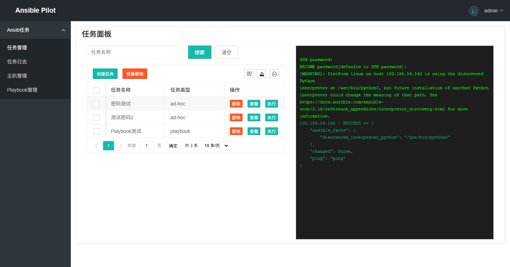
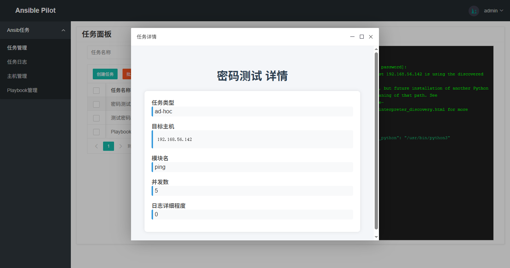
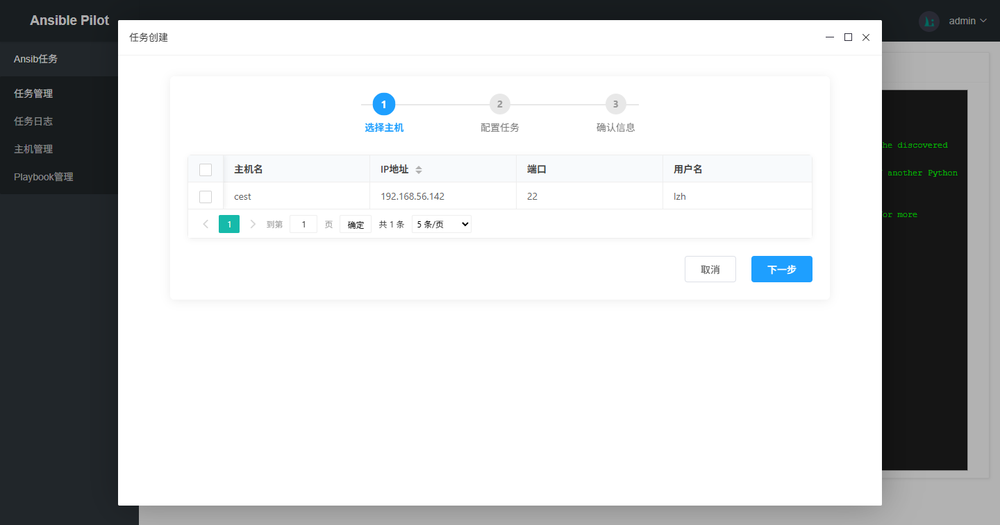
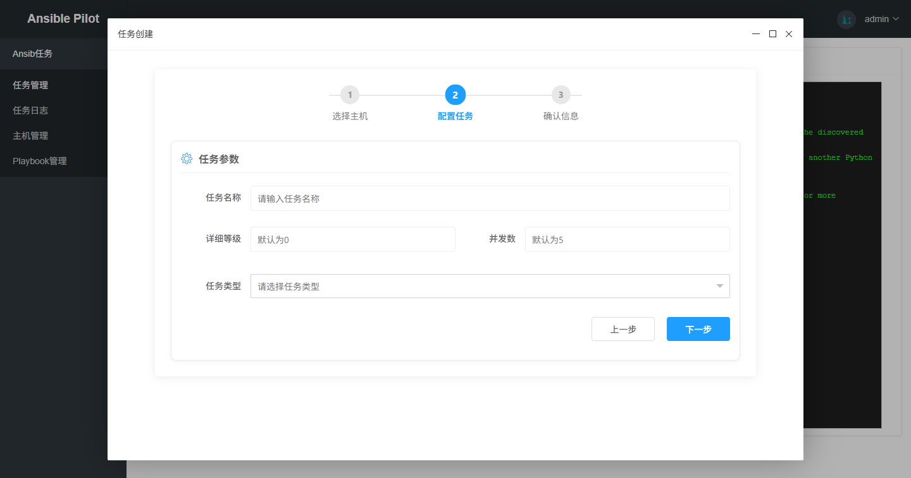
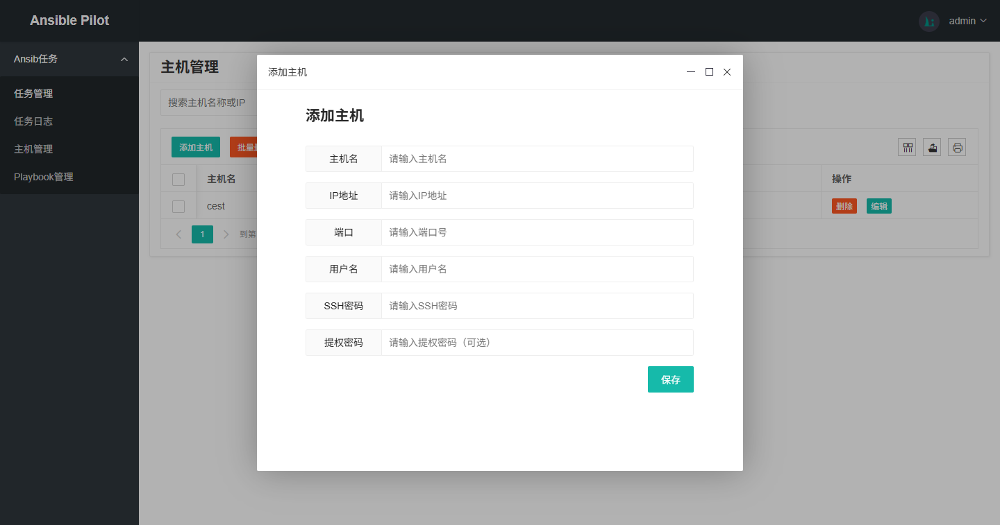
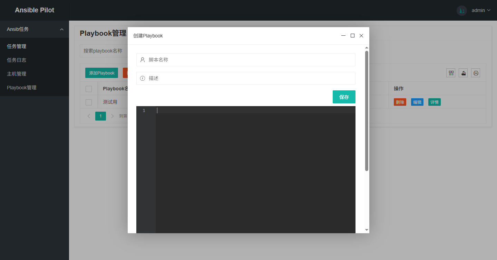

# wb-ansible

### 介绍
Ansible Web管理面板

使用web操作Ansible

### 软件架构
- Django=5.2.4 
- Python=3.11
- layui 
- Celery==5.5.3
- channels==4.2.2
- Redis=7.2.0

### 功能特性
- 主机管理：主机增删改查
- Playbook管理：Playbook脚本增删改查
- 任务管理：执行任务的增删改查，执行时实时返回结果
- 主机密码加密存储，提高安全性
- 任务日志：记录任务执行结果

### docker快速体验
```bash
git clone https://gitee.com/hengjiui/wb-ansible.git
cd wb-ansible/docker-compose
docker-compose up
```
或
```bash
git clone https://gitee.com/hengjiui/wb-ansible.git

cd wb-ansible/docker-compose/django
docker build -t wb-ansible .

cd wb-ansible/docker-compose/worker
docker build -t celery-worker .

cd wb-ansible/
docker run -d --name redis-container -p 6379:6379 redis
docker run -d -p 8000:8000 -v .:/app --name wb-ansible wb-ansible
docker run -d  -v .:/app --name celery-worker celery-worker

```

### 安装流程
1. 安装Redis7、python3.11 
2. 安装依赖 pip3 install --no-cache-dir -r requirements.txt 
3. 进入项目目录 wb-ansible/ 
4. 修改mycelery/config.py 
       `BROKER_URL`、`CELERY_RESULT_BACKEND`的redis地址 
5. 修改setting中ALLOWED_HOSTS地址
6. 数据模型迁移
    `python3 manage.py makemigrations`
    `python3 manage.py migrate`
7. 启动Redis
8. 启动Celery-Work
     `/usr/local/python3/bin/celery -A mycelery.main worker -l info -c 10`
9. 启动Django
    `python3 manage.py  runserver 0.0.0.0:8000`


### 预览








